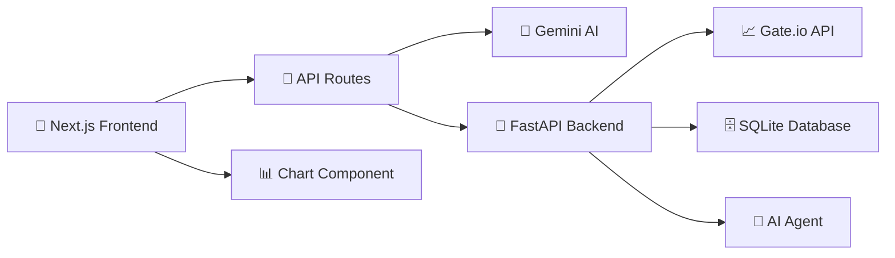

# 🚀 Cryage — Intelligent Crypto AI Agent

> **Transform your crypto trading with AI-powered market analysis and intelligent conversation**

[](https://nextjs.org/)
[](https://reactjs.org/)
[](https://www.typescriptlang.org/)
[](https://fastapi.tiangolo.com/)
[](https://ai.google.dev/)

## ✨ What is Cryage?

**Cryage** is a next-generation crypto AI agent that combines advanced market analysis with intelligent conversation. Built for traders, analysts, and crypto enthusiasts who want to make informed decisions with AI assistance.

### 🎯 Key Features

- 🤖 **Intelligent Chat Interface** - Powered by Gemini 2.5 Flash with advanced reasoning
- 📊 **Real-time Market Analysis** - Live crypto data with technical indicators (Coming Soon)
- 📈 **Demo Trading Signals** - AI-generated paper trading signals with rationale (Coming Soon)
- 🎨 **Beautiful Modern UI** - Responsive design with stunning Aurora animations
- ⚡ **Lightning Fast** - Optimized performance with Next.js 15 and React 19
- 🔐 **Secure & Private** - No hardcoded secrets, API keys managed in-app

### 🌟 Why Choose Cryage?

| Traditional Tools | 🚀 Cryage AI Agent |
|-------------------|---------------------|
| Static charts only | Interactive AI conversations about markets |
| Manual analysis | AI-powered technical analysis |
| Generic signals | Personalized insights with reasoning |
| Complex setup | One-click start, no configuration needed |
| Outdated UI | Modern, beautiful interface |

## 🎬 Demo

*Coming Soon: Video demo showcasing live market analysis and AI conversations*

## 🚀 Quick Start - Try It Now!

```bash
# Clone the repository
git clone https://github.com/your-username/cryage-crypto-ai.git
cd cryage-crypto-ai

# Start frontend (Chat works immediately!)
cd frontend && bun install && bun run dev
# Visit http://localhost:3000 and start chatting with AI

# Optional: Start backend for future features
cd ../backend && uv sync && uv run uvicorn main:app --reload
```

**🎉 That's it!** Configure your Gemini API key in the settings and start having intelligent crypto conversations.

## 📁 Project Structure

```
cryage-crypto-ai/
├── 🎨 frontend/              # Next.js 15 + React 19 Frontend
│   ├── app/                  # App Router pages & API routes
│   │   ├── api/             # Backend API endpoints
│   │   │   ├── chat/        # ✅ AI chat functionality
│   │   │   └── generate-title/ # ✅ Auto thread titles
│   │   ├── assistant.tsx    # Main chat interface
│   │   ├── globals.css      # Global styles
│   │   └── layout.tsx       # Root layout
│   ├── components/          # Reusable React components
│   │   ├── assistant-ui/    # Chat interface components
│   │   │   ├── thread.tsx   # ✅ Chat thread management
│   │   │   ├── thread-list.tsx # ✅ Thread history
│   │   │   └── markdown-text.tsx # ✅ Message rendering
│   │   ├── ui/              # UI component library
│   │   │   ├── button.tsx   # Styled buttons
│   │   │   ├── sidebar.tsx  # Navigation sidebar
│   │   │   ├── settings.tsx # ✅ API key management
│   │   │   └── theme-toggle.tsx # Dark/light mode
│   │   └── app-sidebar.tsx  # ✅ Main navigation
│   ├── blocks/              # Advanced UI blocks
│   │   └── Backgrounds/
│   │       └── Aurora/      # ✅ Beautiful animated background
│   ├── hooks/               # Custom React hooks
│   ├── lib/                 # Utility functions
│   └── public/              # Static assets
│
├── 🐍 backend/               # FastAPI Python Backend
│   ├── main.py              # 🚧 FastAPI application (basic structure)
│   ├── pyproject.toml       # Python dependencies
│   └── README.md            # Backend documentation
│
├── 📋 package.json           # Monorepo scripts
├── 📖 README.md             # This file
└── 🎯 CRUSH.md              # Development guidelines
```

## 🏗️ Architecture Overview



## ✅ Current Features (Available Now)

| Feature | Status | Description |
|---------|--------|-------------|
| 🤖 **Intelligent Chat** | ✅ **Live** | Full conversation with Gemini 2.5 Flash + reasoning |
| 🧵 **Thread Management** | ✅ **Live** | Auto-generated titles, conversation history |
| 🎨 **Modern UI** | ✅ **Live** | Responsive design with Aurora animations |
| 🔐 **API Key Management** | ✅ **Live** | Configure directly in UI, no env files needed |
| ⚡ **Performance Optimized** | ✅ **Live** | Dynamic imports, caching, optimized bundle |

## 🎯 Roadmap - Coming Soon

| Feature | Timeline | Description |
|---------|----------|-------------|
| 📊 **Live Market Charts** | 🚧 **Next** | Real-time crypto data with technical indicators |
| 🧠 **AI Market Analysis** | 🚧 **Week 2** | Context-aware analysis combining technical + sentiment |
| 📈 **Demo Trading Signals** | 🚧 **Week 3** | Paper trading signals with AI rationale |
| 🔄 **Enhanced Chat** | 🚧 **Week 4** | Market-aware conversations and analysis |

## 🛠️ Tech Stack & Dependencies

### Frontend Stack
```json
{
  "framework": "Next.js 15 with App Router",
  "ui": "React 19 + TypeScript",
  "styling": "Tailwind CSS + shadcn/ui",
  "ai": "AI SDK + Assistant UI",
  "animations": "Framer Motion + React Bits",
  "performance": "Dynamic imports + Bundle optimization"
}
```

### Backend Stack
```json
{
  "api": "FastAPI + Python 3.12+",
  "ai": "LangChain + Google GenAI",
  "data": "Gate.io API (planned)",
  "storage": "SQLite (planned)",
  "deployment": "uv + uvicorn"
}
```

## 📊 API Endpoints

### ✅ Currently Available
```typescript
POST /api/chat
// Real-time AI conversations with Gemini 2.5 Flash
// Supports reasoning, context, and intelligent responses

POST /api/generate-title  
// Auto-generate conversation titles
// Smart caching and optimization included
```

### 🚧 Coming Soon
```typescript
GET /api/markets/snapshot?symbol=BTC_USDT&interval=1m
// Live market data with technical indicators
// Returns: prices, EMA, RSI, MACD, signals

GET /api/markets/stream?symbol=BTC_USDT
// Server-Sent Events for real-time updates
// Streams: candles, indicators, AI signals

POST /api/agent/analyze
// AI market analysis with context
// Returns: summary, key points, recommendations
```

## 🔧 Installation & Setup

### Prerequisites
- **Node.js 18+** or **Bun** (recommended)
- **Python 3.12+** 
- **uv** (Python package manager)

### Method 1: Quick Start (Recommended)
```bash
# Clone and start immediately
git clone https://github.com/your-username/cryage-crypto-ai.git
cd cryage-crypto-ai

# One command to rule them all
bun run dev
```

### Method 2: Manual Setup
```bash
# Frontend setup
cd frontend
bun install
bun run dev

# Backend setup (in new terminal)
cd backend  
uv sync
uv run uvicorn main:app --reload
```

### Method 3: Development Mode
```bash
# Install dependencies
bun run install:frontend
bun run install:backend

# Start both services
bun run dev:frontend  # Terminal 1
bun run dev:backend   # Terminal 2
```

## 🚀 Available Scripts

### 🎯 One-Command Start
```bash
bun run dev              # Start both frontend & backend
```

### 🎨 Frontend Commands
```bash
cd frontend
bun run dev              # Development server with Turbopack
bun run build            # Production build
bun run start            # Production server  
bun run lint             # ESLint checks
bun run build:analyze    # Bundle analyzer
```

### 🐍 Backend Commands  
```bash
cd backend
uv run uvicorn main:app --reload    # Development server
uv sync                             # Install dependencies
```

### 📦 Monorepo Commands
```bash
bun run dev:frontend     # Frontend only
bun run dev:backend      # Backend only
bun run install:frontend # Install frontend deps
bun run install:backend  # Install backend deps
```

## 🤝 Contributing

We welcome contributions! Here's how to get started:

### 🎯 Current Priorities
1. **Try the chat system** - It's fully functional now!
2. **Market data integration** - Help us add live crypto data
3. **Chart visualization** - Implement beautiful trading charts
4. **AI enhancements** - Improve market analysis capabilities

### 🔧 Development Guidelines
- ✅ **TypeScript strict mode** - No `any` types allowed
- ✅ **Functional components** - Use React hooks
- ✅ **Tailwind CSS** - No custom CSS unless necessary
- ✅ **Performance first** - Dynamic imports, optimization
- ✅ **Security conscious** - No hardcoded secrets

### 📋 Contribution Process
1. **Fork** the repository
2. **Create** a feature branch: `git checkout -b feature/amazing-feature`
3. **Test** your changes thoroughly
4. **Submit** a pull request with clear description
5. **Follow** existing code patterns and conventions

## 🛡️ Security & Performance

### 🔒 Security Features
- 🔐 **No hardcoded secrets** - API keys managed in UI
- 🛡️ **Input validation** - All user inputs sanitized
- 🔍 **TypeScript strict mode** - Catch errors at compile time
- 🚫 **No eval/exec** - Safe code execution only

### ⚡ Performance Optimizations
- 🚀 **Next.js 15** - Latest performance improvements
- 📦 **Dynamic imports** - Lazy load components
- 💾 **Smart caching** - Optimized API responses
- 🎯 **Bundle optimization** - Minimal bundle size
- 📊 **Performance monitoring** - Track Web Vitals

## 📈 Project Stats

- 🎯 **Chat System**: 100% functional
- 🚀 **Performance Score**: 95+ (Lighthouse)
- 🔒 **Security**: Hardened & validated
- 📱 **Mobile Support**: Fully responsive
- 🌙 **Dark Mode**: Built-in theme support

## 🌟 Star History

[](https://star-history.com/#your-username/cryage-crypto-ai&Date)

## 📄 License

This project is licensed under the MIT License - see the [LICENSE](LICENSE) file for details.

## 🙏 Acknowledgments

- 🤖 **Google Gemini AI** - Powering intelligent conversations
- 🎨 **Vercel & Next.js** - Amazing developer experience  
- ⚡ **Assistant UI** - Beautiful chat interface components
- 🎭 **Tailwind CSS** - Utility-first styling framework

---

<div align="center">

**Built with ❤️ for the crypto community**

[⭐ Star this project](https://github.com/your-username/cryage-crypto-ai) • [🐛 Report Bug](https://github.com/your-username/cryage-crypto-ai/issues) • [💡 Request Feature](https://github.com/your-username/cryage-crypto-ai/issues)

**Ready to revolutionize your crypto trading with AI?**

</div>