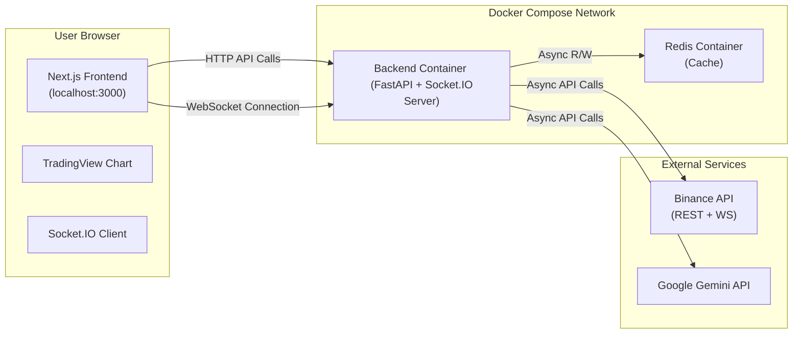

# 🤖 Cryage - AI-Powered Crypto Analysis Platform

<div align="center">


**Real-Time Cryptocurrency Market Intelligence with AI-Driven Insights**

[](/#%EF%B8%8F-current-project-status--phases) <!-- Updated Link -->
[](https://nextjs.org/)
[](https://fastapi.tiangolo.com/)
[](https://socket.io/)
[](https://www.docker.com/)
[](https://tailwindcss.com/)

</div>

## 💎 Overview

**Cryage** transforms the way traders analyze cryptocurrency markets by combining cutting-edge AI technology with real-time data streams and advanced technical analysis. Stop spending hours manually analyzing charts and indicators - let our intelligent system identify opportunities and deliver actionable insights directly to your dashboard.

Built with a modern tech stack including **FastAPI** for a high-performance asynchronous backend and **Next.js** for a reactive frontend, Cryage is designed for speed, scalability, and a smooth user experience. **Docker Compose** orchestrates the development environment, ensuring consistency and ease of setup.

> "Trading is statistics, and Cryage brings those statistics to life through AI interpretation and real-time visualization."

### ✨ What Makes Cryage Special?

- **AI-Powered Analysis**: Google Gemini AI interprets market conditions based on price, volume, and indicators to deliver actionable insights.
- **Real-Time Updates**: Connect directly to Binance data streams via WebSockets for immediate price movements.
- **Efficient Backend**: **FastAPI** provides a high-performance asynchronous API and WebSocket handling, ideal for real-time data.
- **Data Validation**: **Pydantic** ensures data integrity and consistency throughout the backend, reducing errors.
- **Technical Indicator Suite**: Automatically calculate and visualize key indicators like RSI, EMAs, and volume patterns using Pandas.
- **Beautiful Visualization**: Modern, responsive UI with interactive TradingView charts, built with **Next.js**, **Tailwind CSS**, and **Shadcn/ui**.
- **Consistent Development**: **Docker Compose** manages backend (FastAPI), frontend (Next.js), and Redis services for a streamlined, reproducible development workflow.

### ✅ Core MVP Checklist

This project aims to deliver the following core features in its Minimum Viable Product (target completion: end of Phase 5):

- [ ] **Real-time Data:** Display live Binance candlestick data (selected pairs/timeframes).
- [ ] **Historical Data:** Load historical chart data via API.
- [ ] **TA Indicator: RSI:** Calculate and display RSI (14).
- [ ] **TA Indicator: EMAs:** Calculate and display EMAs (34, 89, 200) on chart.
- [ ] **TA Indicator: Volume:** Display volume bars.
- [ ] **Live TA Updates:** Ensure indicators update with new data.
- [ ] **AI Insight:** Integrate Gemini to show one basic consolidated sentiment/signal.
- [ ] **Caching:** Use Redis (async) to cache AI results & market data.
- [ ] **Basic UI:** Functional single-page dashboard with chart, selectors, TA/AI cards.
- [ ] **Responsiveness:** Usable on desktop, basic readability/functionality on mobile.
- [ ] **Theme Toggle:** Basic Light/Dark mode switch.
- [ ] **Deployment:** MVP deployed and accessible via URL using Docker images on a PaaS.

## 🚀 Current Project Status & Phases

The project is being developed iteratively through distinct phases, focusing on both feature delivery and developer learning. **We are currently in Phase 1.**

<table>
  <thead>
    <tr>
      <th>Phase</th>
      <th>Status</th>
      <th>Objective</th>
      <th>Key Deliverables / Focus</th>
    </tr>
  </thead>
  <tbody>
    <tr>
      <td align="center" width="100px">
        
        <h3>Foundation</h3>
      </td>
      <td><b>Active</b></td>
      <td>Establish core project structure, services (via <b>Docker Compose</b>), and basic real-time communication between frontend and backend. Solidify understanding of basic FastAPI, Next.js, Socket.IO, and Docker Compose.</td>
      <td>
        <ul>
          <li>Setup Backend (FastAPI) & Frontend (Next.js) project structures</li>
          <li>Configure <b>Docker Compose</b> for multi-service development (BE, FE, Redis) with volumes for hot-reloading</li>
          <li>Implement basic WebSocket connection (FE <-> BE via Socket.IO ASGI)</li>
          <li>Display empty TradingView chart on frontend</li>
          <li><i><b>Goal:</b> Stable base environment running via <code>docker-compose up</code>. Developer comfortable with basic toolchain.</i></li>
        </ul>
      </td>
    </tr>
    <tr>
      <td align="center" width="100px">
        
        <h3>Core TA</h3>
      </td>
      <td>Upcoming</td>
      <td>Implement essential technical indicators (RSI, EMAs, Vol) in the backend and display them on the frontend chart. Learn Pandas for TA and FastAPI async routes with Pydantic.</td>
      <td>
        <ul>
          <li>Backend TA calculation logic (Pandas) integrated into async service</li>
          <li>Backend API endpoint (FastAPI) for historical data + TA (Pydantic models)</li>
          <li>Frontend chart displaying price, volume, EMAs, RSI via API/WS</li>
          <li>Real-time TA updates via WebSocket</li>
          <li>Implement TanStack Query for frontend data fetching</li>
          <li><i><b>Goal:</b> Live charts showing price & core indicators, updating dynamically.</i></li>
        </ul>
      </td>
    </tr>
    <tr>
      <td align="center" width="100px">
        
        <h3>AI Integration</h3>
      </td>
      <td>Upcoming</td>
      <td>Integrate Google Gemini API for market insights and implement Redis caching using the <b>Dockerized Redis service</b>. Learn async external API calls and caching strategies.</td>
      <td>
        <ul>
          <li>Backend service to call Gemini API (async, using Agno)</li>
          <li><b>Async Redis</b> caching for AI results & market data</li>
          <li>Frontend UI to display AI insight</li>
          <li>Periodic AI insight updates via WebSocket (`analysis:update`)</li>
          <li>Secure API key management (via <code>.env</code> and Docker Compose)</li>
          <li><i><b>Goal:</b> AI-generated insights displayed based on market data, demonstrating caching.</i></li>
        </ul>
      </td>
    </tr>
    <tr>
      <td align="center" width="100px">
        
        <h3>Polish & Test</h3>
      </td>
      <td>Upcoming</td>
      <td>Refine UI/UX using Shadcn/Tailwind, implement error handling/logging, add initial automated API tests, and prepare <b>production Dockerfiles</b>. Learn UI libraries, testing, and Docker optimization.</td>
      <td>
        <ul>
          <li>UI refinements (Shadcn/Tailwind) & basic responsiveness</li>
          <li>Backend error handling (FastAPI exception handlers) & logging</li>
          <li>Automated API tests (FastAPI TestClient with Pytest)</li>
          <li><b>Optimized production Dockerfiles</b> for backend and frontend</li>
          <li><i><b>Goal:</b> Feature-complete, tested MVP codebase ready for deployment build.</i></li>
        </ul>
      </td>
    </tr>
    <tr>
      <td align="center" width="100px">
        
        <h3>MVP Launch</h3>
      </td>
      <td>Upcoming</td>
      <td>Deploy the Minimum Viable Product to a live environment using the <b>built Docker images</b>. Learn basic PaaS deployment and production configuration.</td>
      <td>
        <ul>
          <li>Build production Docker images</li>
          <li>Deploy backend (FastAPI/Uvicorn container) & frontend (static/container) to PaaS/CDN (e.g., Render, Vercel)</li>
          <li>Configure production environment variables securely</li>
          <li>Verify live application functionality end-to-end</li>
          <li>Setup basic PaaS monitoring/logging</li>
          <li><i><b>Goal:</b> Stable, deployed MVP accessible online.</i></li>
        </ul>
      </td>
    </tr>
     <tr>
      <td align="center" width="100px">
        
        <h3>Iteration</h3>
      </td>
      <td>Future</td>
      <td>Enhance capabilities based on feedback and implement features from the roadmap, continuing development using the <b>Docker Compose environment</b>.</td>
      <td>
        <ul>
          <li>Bug fixes & performance improvements</li>
          <li>Implement prioritized Post-MVP features (More TA, Smarter AI, UX enhancements etc.)</li>
          <li>Gather user feedback</li>
          <li>Continue learning based on new feature requirements</li>
          <li><i><b>Goal:</b> Continuous improvement and feature expansion.</i></li>
        </ul>
      </td>
    </tr>
  </tbody>
</table>

## 🛠️ Features & Roadmap

<table>
  <thead>
    <tr>
      <th>Feature Category</th>
      <th>MVP Core (Target End of Phase 5)</th>
      <th>Post-MVP Expansion (Phase 6+)</th>
    </tr>
  </thead>
  <tbody>
    <tr>
      <td><b>Market Data</b></td>
      <td>
        ✓ Binance Real-time WebSockets (via Backend Service)<br/>
        ✓ Socket.IO for Real-time Transport (FastAPI ASGI)<br/>
        ✓ Selectable Timeframes (15m, 1h, 4h, 1d)<br/>
        ✓ Limited Symbol Selection (e.g., BTC/USDT, ETH/USDT)
      </td>
      <td>
        [ ] Additional Exchanges (e.g., Coinbase, KuCoin)<br/>
        [ ] Expanded Historical Data Access & Granularity<br/>
        [ ] User-defined Symbol Watchlists
      </td>
    </tr>
    <tr>
      <td><b>Technical Analysis</b></td>
      <td>
        ✓ RSI Indicator (14)<br/>
        ✓ EMAs (34, 89, 200) on Price Chart<br/>
        ✓ Volume Bars<br/>
        ✓ Real-time Indicator Updates (via WebSocket Push)
      </td>
      <td>
        [ ] MACD Analysis<br/>
        [ ] Volume Profile<br/>
        [ ] Algorithmic Support/Resistance Levels<br/>
        [ ] Basic Chart Pattern Detection (e.g., Head & Shoulders)<br/>
        [ ] Customizable Indicator Parameters
      </td>
    </tr>
    <tr>
      <td><b>AI Analysis (Gemini)</b></td>
      <td>
        ✓ Basic Market Sentiment Score/Signal (Consolidated)<br/>
        ✓ Agno Prompt Orchestration<br/>
        ✓ Periodic AI Insight Updates (triggered by Backend)<br/>
        ✓ Async Redis Caching for AI Results
      </td>
      <td>
        [ ] AI-Generated Price Target Ranges<br/>
        [ ] Risk/Reward Assessment Summary<br/>
        [ ] Multi-timeframe AI Synthesis<br/>
        [ ] Pattern Interpretation/Explanation Text<br/>
        [ ] News Sentiment Integration
      </td>
    </tr>
    <tr>
      <td><b>User Interface</b></td>
      <td>
        ✓ Single-Page Dashboard Layout (Next.js App Router)<br/>
        ✓ Interactive TradingView Lightweight Chart<br/>
        ✓ TA & AI Display Cards (Shadcn/ui)<br/>
        ✓ Symbol/Timeframe Selectors<br/>
        ✓ Light/Dark Theme Toggle (Zustand/Next-Themes)<br/>
        ✓ Basic Responsiveness (Desktop Focus, Mobile Readable)
      </td>
      <td>
        [ ] Customizable Dashboard Layouts<br/>
        [ ] Advanced Charting Options/Drawing Tools<br/>
        [ ] User Accounts & Saved Preferences (requires DB)<br/>
        [ ] Fully Polished Mobile Experience<br/>
        [ ] Command Palette / Quick Actions<br/>
        [ ] UI Animations (Framer Motion)
      </td>
    </tr>
     <tr>
      <td><b>Infrastructure</b></td>
      <td>
        ✓ FastAPI Async Backend (Python/Pydantic)<br/>
        ✓ Next.js Frontend (React/TypeScript)<br/>
        ✓ **Docker Compose for Development Environment**<br/>
        ✓ Async Redis Caching<br/>
        ✓ Simple PaaS Deployment (using Docker Images)
      </td>
      <td>
        [ ] PostgreSQL Database (User Data, Settings - likely add to Docker Compose)<br/>
        [ ] Advanced Monitoring (Prometheus/Grafana)<br/>
        [ ] Scaled Cloud Deployment (K8s/Managed Services)<br/>
        [ ] CI/CD Pipeline (e.g., GitHub Actions)
      </td>
    </tr>
  </tbody>
</table>

## 📊 How It Works

Cryage operates through a sophisticated real-time data processing pipeline built on modern asynchronous technologies, orchestrated during development by Docker Compose.

### High-Level Architecture (Development Environment)


```mermaid
graph LR
    subgraph "User Browser"
        direction TB
        UserInterface["Next.js Frontend <br> (localhost:3000)"]
        Chart["TradingView Chart"]
        WSClient["Socket.IO Client"]
    end

    subgraph "Docker Compose Network"
        direction TB
        BackendContainer["Backend Container <br> (FastAPI + Socket.IO Server)"]
        RedisContainer["Redis Container <br> (Cache)"]

        BackendContainer -- "Async R/W" --> RedisContainer
    end

    subgraph "External Services"
        BinanceAPI["Binance API <br> (REST + WS)"]
        GeminiAPI["Google Gemini API"]
    end

    UserInterface -- "HTTP API Calls" --> BackendContainer;
    UserInterface -- "WebSocket Connection" --> BackendContainer;
    BackendContainer -- "Async API Calls" --> BinanceAPI;
    BackendContainer -- "Async API Calls" --> GeminiAPI;
```

### Detailed Process Flow

1.  **Data Acquisition (Backend - `services/binance_service.py`)**: Establishes asynchronous WebSocket connections to Binance for subscribed symbols/timeframes. Receives real-time candle data. Also fetches historical data via Binance REST API when needed (e.g., initial chart load). Runs inside the `backend` Docker container.
2.  **Real-time Processing (Backend - FastAPI + `websockets/events.py`)**:
    *   Incoming Binance WebSocket data triggers processing within the FastAPI application.
    *   Data is potentially normalized and the latest candlestick data is cached in the **Redis container** (using an async client).
    *   Relevant market updates (`market:update` event) are sent immediately to subscribed frontend clients via the Socket.IO ASGI server mounted on FastAPI.
3.  **Analysis Trigger (Backend - `services/analysis_service.py`)**: Periodically (e.g., on new candle close or a fixed timer), the analysis service initiates an asynchronous task within the FastAPI backend.
4.  **TA Calculation (Backend - `services/indicator_service.py`)**: Retrieves necessary recent price data (primarily from the **Redis cache**) and calculates RSI, EMAs, etc., using the Pandas library. This might run synchronously within the async task context handled by FastAPI.
5.  **AI Analysis (Backend - `services/gemini_service.py`)**:
    *   Checks the **Redis container** cache for a recent AI insight for the specific symbol/timeframe (async).
    *   If the cache misses or the data is stale, it formats the current market data (price, volume, TA results) into a structured prompt (using the Agno framework).
    *   Calls the Google Gemini API asynchronously using an HTTP client like `httpx`.
    *   Validates the AI response structure using Pydantic schemas and caches the result in **Redis** (async) with an appropriate expiry time.
6.  **Analysis Broadcast (Backend - FastAPI + `websockets/events.py`)**: The combined TA results and the fetched/cached AI insight are packaged into an `AnalysisResultObject` (Pydantic model). This object is sent to subscribed frontend clients via a Socket.IO event (`analysis:update`).
7.  **Frontend Visualization (Frontend - Next.js Container)**:
    *   The Socket.IO client (`lib/socket.ts`) running in the browser receives `market:update` and `analysis:update` events from the backend container.
    *   State management libraries (TanStack Query for server state, Zustand for simple UI state) update their stores based on the received data. TanStack Query cache might be invalidated or updated directly.
    *   React components (`components/dashboard/*`) re-render automatically to display the latest chart data (using the TradingView Lightweight Charts library), updated indicator values, and the refreshed AI insights.

The system heavily leverages **FastAPI's** native asynchronous capabilities (`async`/`await`) and the **Uvicorn** ASGI server for efficiently handling many concurrent WebSocket connections and I/O operations (Binance streams, Gemini API calls, Redis access). **Pydantic** is crucial for ensuring data consistency between services, APIs, and WebSocket events. **Docker Compose** provides the isolated, networked environment for these services to run together during development.

## 🚦 Getting Started

### Prerequisites

Make sure you have the following installed on your host machine:

1.  **Docker & Docker Compose:** Essential for building and running the multi-container development environment. ([Install Docker](https://docs.docker.com/get-docker/))
2.  **Git:** For cloning the repository. ([Install Git](https://git-scm.com/book/en/v2/Getting-Started-Installing-Git))
3.  **Node.js:** Version 18+ required for the frontend **build process** inside the Docker container. You don't need to run `npm install` locally. ([Install Node.js](https://nodejs.org/) or use [nvm](https://github.com/nvm-sh/nvm))

*Note: Local installation of Python, Conda, virtual environments, or Redis is **not** required. These services run within isolated Docker containers managed by Docker Compose.*

### Project Setup

1.  **Clone the Repository:**
    ```bash
    git clone https://github.com/ultimatebrok/cryage.git
    cd cryage
    ```

2.  **Configure Environment Variables:**
    *   **Backend (`cryage_backend/.env`):** Copy the example file and add your **secret** API keys.
        ```bash
        cp cryage_backend/.env.example cryage_backend/.env
        ```
        Edit `cryage_backend/.env` using a text editor and input your actual Binance API Key/Secret and Google Gemini API Key.
        ```dotenv
        # cryage_backend/.env
        # --- Binance ---
        BINANCE_API_KEY="YOUR_BINANCE_API_KEY"
        BINANCE_API_SECRET="YOUR_BINANCE_SECRET_KEY"

        # --- Google Gemini ---
        GEMINI_API_KEY="YOUR_GOOGLE_GEMINI_API_KEY"

        # --- Redis (usually default is fine for Docker Compose) ---
        REDIS_HOST="redis" # Service name in docker-compose.yml
        REDIS_PORT=6379
        # REDIS_PASSWORD= # Add if your Redis requires a password

        # --- App Settings ---
        # Allowed origins for CORS (adjust if needed, * is insecure for prod)
        ALLOWED_ORIGINS='["http://localhost:3000", "http://127.0.0.1:3000"]'
        ```
        **⚠️ Important:** Do **NOT** commit your `.env` file with secrets to Git. The `.gitignore` file should already be configured to prevent this.

    *   **Frontend (`cryage_frontend/.env.local`):** Copy the example file. Usually, no changes are needed for local Docker Compose setup.
        ```bash
        cp cryage_frontend/.env.local.example cryage_frontend/.env.local
        ```
        The default `NEXT_PUBLIC_WS_URL` should point to your backend running inside Docker.
        ```dotenv
        # cryage_frontend/.env.local
        # URL for the WebSocket connection to the backend
        # Default assumes frontend runs on host localhost:3000 and backend is exposed on host localhost:5000 by docker-compose
        NEXT_PUBLIC_WS_URL="ws://localhost:5000/socket.io/"
        # URL for API calls (if needed directly from client, TanStack Query often uses relative paths or configured base URL)
        # NEXT_PUBLIC_API_URL="http://localhost:5000/api"
        ```

3.  **Build and Run with Docker Compose:**
    *   Navigate to the **root** directory of the project (`cryage/`).
    *   Run the following command:
        ```bash
        docker-compose up -d --build
        ```
    *   `--build`: Forces Docker to rebuild the images based on the `Dockerfile`s. Use this on the first run and whenever you change dependencies (`requirements.txt`, `package.json`) or the `Dockerfile` itself.
    *   `-d`: Runs the containers in detached mode (in the background). Omit `-d` to see logs directly in the terminal (press `Ctrl+C` to stop).
    *   This command will:
        *   Read the `docker-compose.yml` file.
        *   Build the `backend` and `frontend` Docker images (installing Python/Node dependencies inside the images).
        *   Start containers for the `backend`, `frontend`, and `redis` services.
        *   Create a shared Docker network so containers can communicate using service names (e.g., `backend` can reach `redis` at `redis:6379`).
        *   Mount local source code directories into the containers (for hot-reloading during development).
        *   Map container ports to your host machine (e.g., host:3000 -> frontend:3000, host:5000 -> backend:5000).

## 🚀 Running the Application

1.  **Start Services:** If not already running, use the Docker Compose command from the root directory:
    ```bash
    docker-compose up -d
    ```
    (Use `--build` if you made changes that require rebuilding images).

2.  **View Logs (Optional):** To monitor the output from all running containers:
    ```bash
    docker-compose logs -f
    ```
    To view logs for a specific service (e.g., the backend):
    ```bash
    docker-compose logs -f backend
    ```
    (Press `Ctrl+C` to stop following logs).

3.  **Access the Application:** Open your web browser and navigate to:
    ```
    http://localhost:3000
    ```
    (This is the default port mapped for the `frontend` service in `docker-compose.yml`).

4.  **Stop Services:** When you are finished working, stop and remove the containers:
    ```bash
    docker-compose down
    ```
    (Add the `-v` flag: `docker-compose down -v` if you also want to remove the data volume used by Redis, effectively clearing the cache).

### Verifying Phase 1 Success (Initial Setup)

The initial setup (reaching the end of Phase 1's goal) is successful when:

1.  All three containers (`backend`, `frontend`, `redis`) start without errors using `docker-compose up`. Check `docker ps` or Docker Desktop.
2.  The frontend UI loads successfully in your browser at `http://localhost:3000` (it might show an empty chart initially).
3.  The frontend successfully establishes a WebSocket connection to the backend. Check:
    *   **Browser Console (F12 -> Console):** Look for messages indicating a successful Socket.IO connection.
    *   **Backend Logs (`docker-compose logs -f backend`):** Look for connection messages from Socket.IO/FastAPI.

### Troubleshooting Common Issues

<details>
<summary><b>Docker Compose Errors (Build/Start Failures)</b></summary>

- **Port Conflicts:** Error messages like `Error starting userland proxy: listen tcp4 0.0.0.0:3000: bind: address already in use`. Another application on your host is using port 3000, 5000, or 6379. Stop the other application or change the `ports` mapping in `docker-compose.yml` (e.g., `"8080:3000"` to map host port 8080 to container port 3000).
- **Build Failures:** Check the detailed output during the build process (run `docker-compose build` without `-d`). Common causes:
    - Network issues preventing download of dependencies (`pip install`, `npm install`). Check your internet connection.
    - Syntax errors in `Dockerfile`, `requirements.txt`, or `package.json`.
    - Missing build tools or system libraries if installing packages that need compilation. Adjust the `Dockerfile` to install necessary dependencies (`apt-get update && apt-get install -y ...`).
- **Volume/Permission Issues:** Error messages related to mounting directories. Ensure Docker has permissions to access the project folders on your host. On Linux, you might need to adjust file ownership or run Docker commands with `sudo` (less recommended, better to add user to `docker` group). Check Docker Desktop settings for file sharing on Mac/Windows.
- **Network Issues (Container-to-Container):** Backend fails to connect to Redis (`redis:6379`). Ensure service names in `.env` file (`REDIS_HOST=redis`) match the service names in `docker-compose.yml`. Use `docker-compose down` and `docker-compose up` to recreate the network. Check `depends_on` in `docker-compose.yml` if one service needs another to be ready (though this doesn't guarantee full readiness).
</details>

<details>
<summary><b>Backend (FastAPI Container) Issues</b></summary>

- **Check Logs:** `docker-compose logs -f backend`. Look for Python tracebacks, `uvicorn` errors, Pydantic validation errors, or connection error messages (to Redis, Binance, Gemini).
- **Environment Variables:** Ensure the `cryage_backend/.env` file exists, is correctly populated with your API keys, and is being read by the container (check the `env_file` setting under the `backend` service in `docker-compose.yml`). Incorrect or missing keys are a common cause of errors when interacting with external APIs.
- **API Key Permissions:** Verify that your Binance and Gemini API keys have the necessary permissions enabled on their respective platforms.
- **Redis Connection:** If Redis seems unavailable, ensure the `redis` service is running (`docker ps`) and the hostname/port in `cryage_backend/.env` match the Docker service name/port.
</details>

<details>
<summary><b>Frontend (Next.js Container) Issues</b></summary>

- **Check Container Logs:** `docker-compose logs -f frontend`. Look for Node.js/Next.js errors during startup or runtime.
- **Check Browser Console (F12):** This is crucial. Look for JavaScript errors, React errors, failed network requests (check the Network tab - 4xx/5xx errors when calling the backend API), or WebSocket connection errors (`ws://localhost:5000/...`).
- **Backend URL Configuration:** Ensure `NEXT_PUBLIC_WS_URL` in `cryage_frontend/.env.local` is correct (usually `ws://localhost:5000/socket.io/` when running via Docker Compose with default port mappings). If API calls are made directly, ensure the API URL is also correct.
- **Hot Reloading Not Working:** Ensure volumes are correctly mounted in `docker-compose.yml` and that file watching isn't encountering issues (can sometimes happen on certain OS/Docker configurations). Restarting Docker Compose might help.
</details>

<details>
<summary><b>WebSocket Connection Issues</b></summary>

- **CORS Errors:** Check the browser console. If you see CORS errors related to the WebSocket connection, ensure the `ALLOWED_ORIGINS` in `cryage_backend/.env` includes the origin your browser is using (`http://localhost:3000`). FastAPI's `CORSMiddleware` needs to be configured correctly in `app/main.py`.
- **Server Not Running/Reachable:** Ensure the `backend` container is running and didn't crash. Verify the URL in `cryage_frontend/.env.local` (`NEXT_PUBLIC_WS_URL`) points to the correct host port mapped in `docker-compose.yml` (usually 5000).
- **Socket.IO Version Mismatch:** Ensure the `socket.io-client` version in `cryage_frontend/package.json` is compatible with the `python-socketio` version in `cryage_backend/requirements.txt`. Check the libraries' documentation for compatibility.
- **Logs:** Check logs on both client (`docker-compose logs frontend` and browser console) and server (`docker-compose logs backend`) for specific error messages during the connection handshake.
</details>

## 🏗️ Project Structure

### Backend (`cryage_backend/`)

```plaintext
cryage_backend/
├── app/                      # Main FastAPI application source code
│   ├── api/                  # API Routers / Endpoints
│   │   ├── __init__.py
│   │   ├── endpoints/        # Specific endpoint files (e.g., market data, analysis)
│   │   │   ├── __init__.py
│   │   │   ├── market_data.py
│   │   │   └── analysis.py
│   │   └── router.py         # Aggregates all endpoint routers
│   ├── core/                 # Core application settings and utilities
│   │   ├── __init__.py
│   │   ├── config.py         # Pydantic settings management (reads .env)
│   │   ├── logging_conf.py   # Logging configuration setup
│   │   └── redis_client.py   # Async Redis client setup/dependency injector
│   ├── schemas/              # Pydantic Schemas/Models for data validation & serialization
│   │   ├── __init__.py
│   │   ├── common.py
│   │   ├── market.py         # e.g., KlineObject
│   │   └── analysis.py       # e.g., AnalysisResultObject, AiInsight
│   ├── services/             # Business Logic Services (interact with external APIs, cache, DB)
│   │   ├── __init__.py
│   │   ├── analysis_service.py # Orchestrates TA + AI analysis flow
│   │   ├── binance_service.py  # Handles Binance API/WS interaction
│   │   ├── gemini_service.py   # Handles Gemini interaction (incl. Agno)
│   │   └── indicator_service.py# Handles Pandas TA calculations
│   ├── websockets/           # WebSocket (Socket.IO) Logic
│   │   ├── __init__.py
│   │   └── events.py         # Defines Socket.IO event handlers (@sio.event)
│   └── main.py               # FastAPI app instance creation, mount routers/websockets, CORS
├── tests/                    # Automated tests (Pytest)
│   ├── __init__.py
│   ├── conftest.py           # Pytest fixtures (e.g., test client)
│   └── api/                  # API specific tests
│       └── test_market_data.py
├── .env.example              # Example environment variables file
├── .gitignore
├── Dockerfile                # Defines how to build the backend Docker image
├── requirements.txt          # Python dependencies
└── README.md                 # This file (or specific backend notes)
```

### Frontend (`cryage_frontend/`)

```plaintext
cryage_frontend/
├── app/                      # Next.js App Router directory (contains UI pages/layouts)
│   ├── (dashboard)/          # Route group for main dashboard layout/pages
│   │   ├── layout.tsx        # Layout specific to dashboard sections
│   │   └── page.tsx          # Main dashboard page component
│   ├── api/                  # Next.js API routes (minimal use expected, backend handles most logic)
│   │   └── hello/
│   │       └── route.ts
│   ├── favicon.ico
│   ├── globals.css           # Global styles (used by Tailwind)
│   └── layout.tsx            # Root layout (html, body tags, global providers)
├── components/               # Reusable React components
│   ├── icons.tsx             # Icon components (using Lucide)
│   ├── theme-provider.tsx    # Next-themes provider setup
│   ├── theme-toggle.tsx      # Light/dark mode toggle button
│   └── ui/                   # Shadcn/ui components (generated via CLI)
│       ├── button.tsx
│       ├── card.tsx
│       └── ...               # Other generated shadcn components
│   └── dashboard/            # Components specific to the dashboard page
│       ├── analysis-card.tsx # Card displaying AI/TA results
│       ├── chart-wrapper.tsx # Wrapper containing the TradingView chart logic
│       └── symbol-selector.tsx # Dropdown/buttons for symbol/timeframe
├── hooks/                    # Custom React Hooks (for state logic, data fetching abstractions)
│   ├── use-analysis-data.ts
│   └── use-market-data.ts
├── lib/                      # Utility functions, library configurations, client setup
│   ├── api-client.ts         # Functions to call the FastAPI backend (optional, TanStack often handles)
│   ├── query-client.ts       # TanStack Query client setup
│   ├── socket.ts             # Socket.IO client setup and connection logic
│   ├── utils.ts              # General utility functions (formatting, etc.)
│   └── shadcn-utils.ts       # Utility for Shadcn (e.g., cn function)
├── providers/                # React Context Providers (wrap around layout/pages)
│   ├── query-provider.tsx    # TanStack Query provider wrapper
│   └── socket-provider.tsx   # Provider for Socket.IO instance/connection state
├── store/                    # Zustand global state store (for simple, non-server state)
│   └── ui-store.ts           # e.g., theme, simple UI toggles
├── types/                    # TypeScript type definitions
│   └── index.ts              # Shared types (maybe synced with backend schemas)
├── public/                   # Static assets (images, fonts, etc.)
├── .env.local.example        # Example environment variables for frontend
├── .gitignore
├── components.json           # Shadcn/ui configuration file
├── Dockerfile                # Defines how to build the frontend Docker image (for dev/prod)
├── next.config.js            # Next.js configuration file
├── package.json              # Project dependencies (npm/yarn) and scripts
├── postcss.config.js         # PostCSS config (used by Tailwind)
├── tailwind.config.ts        # Tailwind CSS configuration file
├── tsconfig.json             # TypeScript configuration file
└── README.md                 # This file (or specific frontend notes)
```
## 🤝 Contributing

Contributions are welcome! Whether it's reporting a bug, suggesting a feature, or submitting code changes, your input is valuable.

**How to Contribute:**

1.  **Issues:** Check the [GitHub Issues](https://github.com/ultimateBroK/Cryage/issues) for existing bugs or feature requests. If you find something new, please open a new issue.
2.  **Fork & Branch:** Fork the repository and create a new branch for your changes (e.g., `feature/new-indicator` or `fix/chart-bug`).
3.  **Develop:** Make your changes, adhering to the project's coding style and structure.
4.  **Test:** Ensure your changes work as expected and don't break existing functionality. Add tests if applicable (especially for backend logic).
5.  **Pull Request:** Submit a pull request from your branch to the main repository branch. Provide a clear description of your changes.

Please note that this project is currently in active development, and major structural changes might occur.

*(Optionally, you can add: For more detailed guidelines, please refer to the `CONTRIBUTING.md` file (once created).)*

## ⭐ Star History

<div align="center">

[](https://github.com/ultimateBroK/Cryage/stargazers)

</div>

## ✨ Built With & Key Technologies

<div align="center">

**Backend:**

[](https://fastapi.tiangolo.com/)
[](https://www.python.org/)
[](https://python-socketio.readthedocs.io/)
[](https://docs.pydantic.dev/)
[](https://pandas.pydata.org/)

**Frontend:**

[](https://nextjs.org/)
[](https://reactjs.org/)
[](https://www.typescriptlang.org/)
[](https://socket.io/docs/v4/client-api/)
[](https://tailwindcss.com/)
[](https://ui.shadcn.com/)
[](https://tradingview.github.io/lightweight-charts/)

**AI & Data:**

[](https://ai.google.dev/)
[](https://github.com/binance/binance-spot-api-docs)
[](https://redis.io/)

**Infrastructure & Tooling:**

[](https://www.docker.com/)
[](https://www.uvicorn.org/)

**Project Stats:**

[](https://github.com/ultimateBroK/Cryage/stargazers)
[](https://github.com/ultimateBroK/Cryage/issues)
[](./LICENSE) <!-- Adjust link if LICENSE file is elsewhere -->

</div>

## ⚠️ Disclaimer

**Cryage is for informational and educational purposes only. It is NOT financial advice.**

Cryptocurrency trading involves significant risk, and you could lose your capital. The information provided by Cryage, including any AI-generated insights, technical analysis, or data visualizations, may contain errors, inaccuracies, or be incomplete.

- **Do NOT** make trading decisions based solely on the information presented by this tool.
- **Always** conduct your own thorough research (DYOR) and consult with a qualified financial advisor before making any investment decisions.
- The developers and contributors of Cryage assume **NO** responsibility for any trading losses or financial damages incurred as a result of using this software.

Use Cryage at your own risk.

## 📜 License

This project is licensed under the MIT License - see the [LICENSE](LICENSE) file for details.

---

<p align="center">Built with ❤️ using FastAPI, Next.js, Binance API, and Google Gemini AI</p>
<p align="center">
  <a href="https://fastapi.tiangolo.com/"></a>
  <a href="https://nextjs.org/"></a>
  <a href="https://github.com/binance/binance-spot-api-docs"></a>
  <a href="https://ai.google.dev/"></a>
</p>

<div align="center">
  <a href="https://visitor-badge.laobi.icu/badge?page_id=ultimateBroK.Cryage"></a>
  <a href="https://github.com/ultimateBroK/Cryage/stargazers"></a>
  <a href="https://github.com/ultimateBroK/Cryage/issues"></a>
</div>