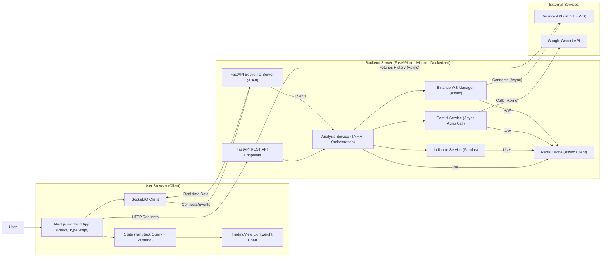

# 🤖 Cryage - AI-Powered Crypto Analysis Platform

<div align="center">


**Real-Time Cryptocurrency Market Intelligence with AI-Driven Insights**

[](/#%EF%B8%8F-current-project-status--phases)
[](https://nextjs.org/)
[](https://fastapi.tiangolo.com/)
[](https://socket.io/)
[](https://www.docker.com/)
[](https://tailwindcss.com/)

</div>

## 💎 Overview

**Cryage** is designed to be a helpful tool for cryptocurrency traders. Analyzing the crypto market manually can be overwhelming and takes a lot of time. Cryage aims to simplify this by automatically gathering market data, performing common technical analysis, and using Artificial Intelligence (AI) to provide quick insights.

Built with a modern tech stack including **FastAPI** (Python) for a high-performance asynchronous backend, **Next.js** (React) for a reactive frontend, and **Pydantic** for robust data validation, Cryage is designed for speed, scalability, and a smooth user experience. **Docker Compose** orchestrates the development environment, ensuring consistency and ease of setup. The project emphasizes an **Async First** approach in the backend for optimal performance.

> "Trading is statistics, and Cryage brings those statistics to life through AI interpretation and real-time visualization."

### ✨ What Makes Cryage Special?

- **AI-Powered Analysis**: Google Gemini AI interprets market conditions based on price, volume, and indicators to deliver actionable insights, orchestrated via the Agno Framework.
- **Real-Time Updates**: Connect directly to Binance data streams (REST & WebSocket) for immediate price movements.
- **Efficient Backend**: **FastAPI** provides a high-performance asynchronous API and WebSocket handling (via `python-socketio` ASGI), ideal for real-time data, running on Uvicorn.
- **Data Validation**: **Pydantic** ensures data integrity and consistency throughout the backend (API I/O, WS messages, cache data), reducing errors and auto-generating API docs.
- **Technical Indicator Suite**: Automatically calculate and visualize key indicators like RSI and EMAs using Pandas.
- **Beautiful Visualization**: Modern, responsive UI with interactive TradingView Lightweight Charts, built with **Next.js**, **Tailwind CSS**, **Shadcn/ui**, Lucide Icons, and Framer Motion for animations. Priority on a **Dark AMOLED Theme** (#000000).
- **Consistent Development & Deployment**: **Docker Compose** manages backend (FastAPI), frontend (Next.js), and Redis services for a streamlined, reproducible development workflow. Production builds utilize **Dockerfiles** for creating optimized images.
- **Frontend State Management**: Efficient data fetching and state management with **TanStack Query** and **Zustand**.
- **Caching**: **Async Redis client** for effective caching of market data and AI-generated insights to improve performance and reduce API load.

### ✅ Core MVP Checklist

This project aims to deliver the following core features in its Minimum Viable Product (target completion: end of Phase 5), as defined in `Plan.md` Section 3.3:

- [ ] **Market Data:** *(In Progress - Phase 2)*
    - [ ] Show live price updates (candlesticks) from Binance.
    - [ ] Load historical price data from Binance.
    - [ ] Allow users to select different timeframes (e.g., 15m, 1h, 4h, 1d).
    - [ ] Start with a small, fixed list of cryptocurrencies (e.g., BTC/USDT, ETH/USDT).
- [ ] **Technical Analysis (TA):** *(Upcoming - Phase 2)*
    - [ ] Calculate and display RSI (period 14).
    - [ ] Calculate and display three EMAs (34, 89, 200) on the price chart.
    - [ ] Show trading volume bars.
    - [ ] Ensure TA indicators update in real-time.
- [ ] **AI Analysis:** *(Upcoming - Phase 3)*
    - [ ] Connect to Google Gemini (via Agno).
    - [ ] Send current market info (price, volume, indicators) to AI.
    - [ ] Display one simple, consolidated AI insight (e.g., sentiment or signal).
    - [ ] Update AI insight periodically (with caching).
- [ ] **User Interface (UI) & Design:** *(Partially Complete - Phase 1, Will Enhance in Phase 4)*
    - [x] **Visual Theme:** Implement **Dark AMOLED Theme** (#000000) as default; provide light mode toggle.
    - [x] **Modern, Clean Design:** Minimalist approach, sufficient whitespace.
    - [x] **Soft UI Elements:** Consistently rounded corners (min 8px) for interactive components.
    - [x] **Layout:** Single-page dashboard, TradingView chart as main element, separate cards for TA/AI.
    - [ ] **Responsiveness:** Fully responsive design (desktop to mobile), touch-friendly elements (min 44x44px).
    - [ ] **Interaction & Animation:** Subtle transitions (Framer Motion), interactive feedback, loading states.
    - [ ] **Accessibility:** Sufficient color contrast, keyboard navigation, ARIA attributes.
- [ ] **Functionality & Stability:** *(In Progress)*
    - [x] Application running live and accessible via URL.
    - [ ] Users can successfully choose crypto pairs and timeframes.
    - [ ] TradingView chart displays accurate live/historical data.
    - [ ] Core features are stable (reliable data streams, correct calculations, AI calls succeed generally).
- [ ] **Deployment:** *(Upcoming - Phase 5)* MVP deployed using Docker images on a PaaS.

## 🚀 Current Project Status & Phases

The project is being developed iteratively through distinct, fluid development streams as outlined in `Plan.md` Section 7. **We are currently in Phase 2: Market Data Stream.**

<table>
  <thead>
    <tr>
      <th>Phase (Stream)</th>
      <th>Status</th>
      <th>Objective (Focus from Plan.md)</th>
      <th>Key Deliverables / Focus (from Plan.md)</th>
      <th>Integration Milestone (Goal from Plan.md)</th>
    </tr>
  </thead>
  <tbody>
    <tr>
      <td align="center" width="150px"> <!-- Adjusted width -->
        
        <h3>Foundation Stream</h3>
        <small>(Weeks 1-3)</small>
      </td>
      <td><b>Completed</b></td>
      <td>Building the substrate that enables all future development.</td>
      <td>
        <ul>
          <li>Functioning multi-container <b>Docker Compose</b> setup (backend, frontend, Redis)</li>
          <li>Complete project architecture with proper folder structures (FastAPI backend, Next.js frontend)</li>
          <li>Established communication channels (WebSocket via Socket.IO ASGI, core API schemas)</li>
          <li>Empty but functional UI with basic TradingView chart component</li>
          <li>State management foundations (TanStack Query, Zustand)</li>
        </ul>
      </td>
      <td><i>Running multi-container system with basic frontend-backend communication and empty chart component.</i></td>
    </tr>
    <tr>
      <td align="center" width="150px">
        
        <h3>Market Data Stream</h3>
        <small>(Weeks 3-7)</small>
      </td>
      <td><b>Active</b></td>
      <td>Creating the complete market data pipeline that powers the application.</td>
      <td>
        <ul>
          <li>Complete Binance API integration (REST + WebSocket)</li>
          <li>Functional data processing pipeline with Redis caching</li>
          <li>Technical analysis calculation engine (Pandas for RSI, EMAs, Volume)</li>
          <li>Live chart with real-time TA updates via WebSocket</li>
        </ul>
      </td>
      <td><i>Functioning chart displaying live market data and accurate technical indicators dynamically updating in real-time.</i></td>
    </tr>
    <tr>
      <td align="center" width="150px">
        
        <h3>Intelligence Stream</h3>
        <small>(Weeks 6-10)</small>
      </td>
      <td>Upcoming</td>
      <td>Adding the AI layer that differentiates the application.</td>
      <td>
        <ul>
          <li>Functioning Google Gemini integration (async, via Agno framework)</li>
          <li>Efficient async Redis caching for AI results</li>
          <li>Structured AI insights delivered to frontend via WebSocket</li>
          <li>Real-time insight updates synchronized with market data</li>
        </ul>
      </td>
      <td><i>Live AI insights appearing alongside technical data, updating in real-time with market changes.</i></td>
    </tr>
    <tr>
      <td align="center" width="150px">
        
        <h3>Experience Stream</h3>
        <small>(Weeks 9-12)</small>
      </td>
      <td>Upcoming</td>
      <td>Refining the interface into a polished, intuitive experience.</td>
      <td>
        <ul>
          <li>Polished UI component system (Shadcn/ui, Tailwind CSS)</li>
          <li>True black AMOLED theme (#000000) and light mode</li>
          <li>Fully responsive design working across all devices (touch-friendly)</li>
          <li>Smooth animations (Framer Motion) and transitions</li>
          <li>Comprehensive error handling and feedback systems</li>
          <li>Accessibility enhancements (ARIA, keyboard navigation)</li>
        </ul>
      </td>
      <td><i>Polished, visually appealing UI with smooth animations and full responsiveness across all device types.</i></td>
    </tr>
    <tr>
      <td align="center" width="150px">
        
        <h3>Deployment Stream</h3>
        <small>(Weeks 11-13)</small>
      </td>
      <td>Upcoming</td>
      <td>Bringing the application to production.</td>
      <td>
        <ul>
          <li>Optimized production Dockerfiles for backend & frontend</li>
          <li>Fully configured PaaS deployment (e.g., Render, Vercel)</li>
          <li>Established monitoring, logging, and feedback mechanisms</li>
          <li>Secure environment variable configuration</li>
        </ul>
      </td>
      <td><i>Fully functioning application deployed to production with monitoring systems in place and initial user feedback mechanisms established.</i></td>
    </tr>
     <tr>
      <td align="center" width="150px">
        
        <h3>Iteration</h3>
        <small>(Post-MVP)</small>
      </td>
      <td>Future</td>
      <td>Enhance capabilities based on feedback and implement features from the roadmap, continuing development using the Docker Compose environment.</td>
      <td>
        <ul>
          <li>Bug fixes & performance improvements</li>
          <li>Implement prioritized Post-MVP features (More TA, Smarter AI, UX enhancements etc.)</li>
          <li>Gather user feedback</li>
          <li>Continue learning based on new feature requirements</li>
          <li><i><b>Goal:</b> Continuous improvement and feature expansion.</i></li>
        </ul>
      </td>
    </tr>
  </tbody>
</table>

## 🛠️ Development Setup

### Prerequisites

- Docker and Docker Compose installed on your system
- Git for version control
- Node.js 18+ and npm/yarn (optional, for local frontend development)
- Python 3.10+ and pip (optional, for local backend development)

### Quick Start with Docker Compose

1. Clone the repository:
   ```bash
   git clone https://github.com/ultimatebrok/cryage.git
   cd cryage
   ```

2. Create environment files:
   ```bash
   # Create .env file for the backend
   # You'll need to manually create this file with the following variables:
   # - BINANCE_API_KEY
   # - BINANCE_API_SECRET
   # - GEMINI_API_KEY
   # - REDIS_HOST (default: redis)
   # - REDIS_PORT (default: 6379)
   # - BACKEND_CORS_ORIGINS (default: ["http://localhost:3000", "http://localhost:8000"])
   touch cryage_backend/.env
   
   # Create .env.local file for the frontend
   # You'll need to manually create this file with:
   # - NEXT_PUBLIC_WS_URL (default: ws://localhost:8000/socket.io/)
   touch cryage_frontend/.env.local
   ```

3. Start the Docker services:
   ```bash
   docker-compose up
   ```

4. Access the application:
   - Frontend: http://localhost:3000
   - Backend API: http://localhost:8000
   - API Documentation: http://localhost:8000/docs

### Development Workflow

#### Git Workflow

Follow the branching strategy outlined in [BRANCHING.md](BRANCHING.md):
- Feature branches: `feature/name-of-feature`
- Bug fixes: `fix/issue-description`
- Documentation: `docs/description`

#### Running Tests

Backend tests:
```bash
# In a separate terminal while Docker is running
docker-compose exec backend pytest
```

Frontend tests:
```bash
# In a separate terminal while Docker is running
docker-compose exec frontend npm test
```

Verify Docker services:
```bash
# From project root
./verify_docker_services.sh
```

#### Development Tools

- **Backend**: FastAPI with automatic API documentation at http://localhost:8000/api/v1/docs
- **Frontend**: Next.js with hot reloading
- **WebSockets**: Socket.IO for real-time communication

#### Useful Commands

```bash
# View logs
docker-compose logs -f

# View logs for a specific service
docker-compose logs -f backend
docker-compose logs -f frontend
docker-compose logs -f redis

# Restart a service
docker-compose restart backend
docker-compose restart frontend

# Stop all services
docker-compose down

# Rebuild services after dependency changes
docker-compose up --build
```

## 🧪 Testing

The project includes several types of tests:

1. **Backend API Tests**: Tests API endpoints using pytest and FastAPI's TestClient
2. **WebSocket Tests**: Tests WebSocket communication
3. **Chart Component Tests**: Tests the frontend chart components using Jest and React Testing Library
4. **Docker Integration Tests**: Verifies that all services communicate correctly

Run the tests as described in the Development Workflow section.

## 📁 Project Structure

```
cryage/
├── cryage_backend/               # FastAPI backend
│   ├── app/
│   │   ├── api/                  # API endpoints
│   │   ├── core/                 # Core configuration
│   │   ├── schemas/              # Pydantic models
│   │   ├── services/             # Business logic services
│   │   ├── websockets/           # WebSocket handling
│   │   └── main.py               # Application entry point
│   ├── tests/                    # Backend tests
│   └── Dockerfile.dev            # Development Dockerfile
├── cryage_frontend/              # Next.js frontend
│   ├── app/                      # Next.js app directory
│   ├── components/               # React components
│   ├── hooks/                    # Custom React hooks
│   ├── lib/                      # Utility functions
│   ├── providers/                # Context providers
│   ├── store/                    # State management
│   ├── types/                    # TypeScript types
│   ├── __tests__/                # Frontend tests
│   └── Dockerfile.dev            # Development Dockerfile
├── phases/                       # Development phase documentation
│   ├── 01-foundation-stream.md   # Phase 1 details and checklist
│   ├── 02-market-data-stream.md  # Phase 2 details and checklist
│   ├── 03-intelligence-stream.md # Phase 3 details and checklist
│   ├── 04-experience-stream.md   # Phase 4 details and checklist
│   └── 05-deployment-stream.md   # Phase 5 details and checklist
├── docker-compose.yml            # Docker Compose configuration
└── README.md                     # Project documentation
```

## 🛠️ Features & Roadmap

<table>
  <thead>
    <tr>
      <th>Feature Category</th>
      <th>MVP Core (Target End of Phase 5)</th>
      <th>Post-MVP Expansion (Phase 6+)</th>
    </tr>
  </thead>
  <tbody>
    <tr>
      <td><b>Market Data</b></td>
      <td>
        ✓ Live Price Updates (Binance Candlesticks)<br/>
        ✓ Historical Price Data (Binance API)<br/>
        ✓ Selectable Timeframes (15m, 1h, 4h, 1d)<br/>
        ✓ Limited Symbol Selection (e.g., BTC/USDT, ETH/USDT)
      </td>
      <td>
        [ ] Additional Exchanges (e.g., Coinbase, KuCoin)<br/>
        [ ] Expanded Historical Data Access & Granularity<br/>
        [ ] User-defined Symbol Watchlists
      </td>
    </tr>
    <tr>
      <td><b>Technical Analysis</b></td>
      <td>
        ✓ RSI Indicator (14)<br/>
        ✓ EMAs (34, 89, 200) on Price Chart<br/>
        ✓ Volume Bars<br/>
        ✓ Real-time Indicator Updates
      </td>
      <td>
        [ ] MACD Analysis<br/>
        [ ] Volume Profile<br/>
        [ ] Automatic Support/Resistance Lines<br/>
        [ ] Chart Pattern Recognition<br/>
        [ ] Customizable Indicator Parameters
      </td>
    </tr>
    <tr>
      <td><b>AI Analysis (Gemini)</b></td>
      <td>
        ✓ Basic Consolidated AI Insight (e.g., Sentiment/Signal)<br/>
        ✓ Agno Prompt Orchestration<br/>
        ✓ Periodic AI Insight Updates (via Cache)<br/>
        ✓ Async Redis Caching for AI Results
      </td>
      <td>
        [ ] AI-Generated Price Target Ranges<br/>
        [ ] Risk/Reward Assessment Summary<br/>
        [ ] AI Analysis Across Multiple Timeframes<br/>
        [ ] Explanations for Patterns/Signals<br/>
        [ ] News Sentiment Integration
      </td>
    </tr>
    <tr>
      <td><b>User Interface</b></td>
      <td>
        ✓ Single-Page Dashboard Layout (Next.js App Router)<br/>
        ✓ Interactive TradingView Lightweight Chart<br/>
        ✓ TA & AI Display Cards (Shadcn/ui, Rounded Corners, Shadows)<br/>
        ✓ Symbol/Timeframe Selectors (Dropdowns/Pills)<br/>
        ✓ Dark AMOLED Theme (#000000) & Light Mode Toggle (Zustand/Next-Themes)<br/>
        ✓ Fully Responsive Design (Desktop, Tablet, Mobile; Touch Targets >= 44px)<br/>
        ✓ Subtle Animations & Transitions (Framer Motion, 300-500ms)<br/>
        ✓ ARIA Support & Keyboard Navigation
      </td>
      <td>
        [ ] Customizable Dashboard Layouts<br/>
        [ ] Advanced Charting Options/Drawing Tools<br/>
        [ ] User Accounts & Saved Preferences (requires DB)<br/>
        [ ] Fully Polished Mobile Experience<br/>
        [ ] Command Palette / Quick Actions<br/>
        [ ] UI Animations (Framer Motion)
      </td>
    </tr>
     <tr>
      <td><b>Infrastructure</b></td>
      <td>
        ✓ FastAPI Async Backend (Python/Pydantic, Uvicorn Server)<br/>
        ✓ Next.js Frontend (React/TypeScript)<br/>
        ✓ **Docker Compose for Development Environment** (BE, FE, Redis)<br/>
        ✓ Async Redis Caching (python `redis` async client)<br/>
        ✓ Simple PaaS Deployment (using **built Docker Images from Dockerfiles**)
      </td>
      <td>
        [ ] PostgreSQL Database (User Data, Settings - likely add to Docker Compose)<br/>
        [ ] Advanced Monitoring (Prometheus/Grafana)<br/>
        [ ] Scaled Cloud Deployment (K8s/Managed Services)<br/>
        [ ] CI/CD Pipeline (e.g., GitHub Actions)
      </td>
    </tr>
  </tbody>
</table>

## 📊 How It Works

Cryage operates through a sophisticated real-time data processing pipeline built on modern asynchronous technologies, orchestrated during development by Docker Compose. This design aligns with `Plan.md` Sections 4 & 5.

### High-Level Architecture (Development & MVP Deployment)

The development environment uses Docker Compose. The MVP deployment will utilize Docker images built from the project's Dockerfiles deployed to PaaS providers.


```mermaid
graph LR
    subgraph "User Browser (Client)"
        direction TB
        FrontendApp["Next.js Frontend App (React, TypeScript)"]
        StateMgmt["State (TanStack Query + Zustand)"]
        TradingChart["TradingView Lightweight Chart"]
        SocketIOClient["Socket.IO Client"]
        FrontendApp --> StateMgmt --> TradingChart
        FrontendApp --> SocketIOClient
    end

    subgraph "Backend Server (FastAPI on Uvicorn - Dockerized)"
        direction TB
        APIServer["FastAPI REST API Endpoints"]
        WebSocketServer["FastAPI Socket.IO Server (ASGI)"]
        AnalysisService["Analysis Service (TA + AI Orchestration)"]
        RedisCache["Redis Cache (Async Client)"]
        BinanceManager["Binance WS Manager (Async)"]
        IndicatorCalc["Indicator Service (Pandas)"]
        GeminiCaller["Gemini Service (Async Agno Call)"]

        APIServer --> AnalysisService
        WebSocketServer -- Events --> AnalysisService
        AnalysisService --> IndicatorCalc
        AnalysisService --> GeminiCaller
        AnalysisService --> BinanceManager
        AnalysisService -- R/W --> RedisCache
        IndicatorCalc -- Uses --> RedisCache
        GeminiCaller -- R/W --> RedisCache
        BinanceManager -- R/W --> RedisCache
    end

    subgraph "External Services"
        BinanceExchange["Binance API (REST + WS)"]
        GoogleGemini["Google Gemini API"]
    end

    User --> FrontendApp
    FrontendApp -- "HTTP Requests" --> APIServer
    SocketIOClient -- "Connects/Events" --> WebSocketServer
    WebSocketServer -- "Real-time Data" --> SocketIOClient

    BinanceManager -- "Connects (Async)" --> BinanceExchange
    APIServer -- "Fetches History (Async)" --> BinanceExchange
    GeminiCaller -- "Calls (Async)" --> GoogleGemini
```

### Detailed Process Flow (MVP)

1.  **User Interaction (Frontend)**: User selects a cryptocurrency pair and timeframe on the Next.js frontend.
2.  **Subscription (Frontend -> Backend)**: The frontend sends a `subscribe` message via Socket.IO to the FastAPI backend.
3.  **Binance Connection (Backend - `services/binance_service.py`)**:
    *   The `BinanceService` (or `BinanceMgr`) establishes/maintains an asynchronous WebSocket connection to Binance for the requested live data stream.
    *   Historical data for initial chart load is fetched via Binance REST API if not cached.
4.  **Real-time Data Processing & Caching (Backend)**:
    *   As new price data arrives from Binance WebSocket, `BinanceService` processes it (e.g., forms a candlestick).
    *   Latest data is saved to **Redis cache** (async).
    *   A `market:update` event with the new `KlineObject` is sent via Socket.IO (from `websockets/events.py`) to subscribed frontend clients.
5.  **Frontend Chart Update (Frontend)**: The `market:update` event is received, TanStack Query updates its cache, and the TradingView chart re-renders.
6.  **Analysis Trigger (Backend - `services/analysis_service.py`)**:
    *   Triggered by a new candlestick closing or on a timer.
    *   The `AnalysisService` retrieves recent price data from **Redis cache** (async).
7.  **TA Calculation (Backend - `services/indicator_service.py`)**:
    *   `IndicatorService` uses Pandas to calculate TA indicators (RSI, EMAs) from the price data.
8.  **AI Insight Generation (Backend - `services/gemini_service.py`)**:
    *   `GeminiService` checks **Redis cache** for a recent AI insight (async).
    *   If cache miss/stale: prepares data (price, volume, TA) and calls Google Gemini API (async, using Agno for prompt structure).
    *   The AI insight is validated (Pydantic) and saved to **Redis cache** (async).
9.  **Analysis Broadcast (Backend - `websockets/events.py`)**:
    *   `AnalysisService` combines TA results and AI insight into an `AnalysisResultObject`.
    *   This object is saved to **Redis cache** (async).
    *   An `analysis:update` event is sent via Socket.IO to subscribed frontend clients.
10. **Frontend UI Update (Frontend)**: The `analysis:update` event is received, TanStack Query updates, and UI cards display the new TA values and AI insight.

The system heavily leverages **FastAPI's** native asynchronous capabilities (`async`/`await`) and the **Uvicorn** ASGI server for efficiently handling many concurrent WebSocket connections and I/O operations (Binance streams, Gemini API calls, Redis access). **Pydantic** is crucial for ensuring data consistency between services, APIs, and WebSocket events. **Docker Compose** provides the isolated, networked environment for these services to run together during development.

## 🚦 Getting Started

### Prerequisites

Make sure you have the following installed on your host machine:

1.  **Docker & Docker Compose:** Essential for building and running the multi-container development environment. ([Install Docker](https://docs.docker.com/get-docker/))
2.  **Git:** For cloning the repository. ([Install Git](https://git-scm.com/book/en/v2/Getting-Started-Installing-Git))
3.  **Node.js:** Version 18+ (or as specified in `cryage_frontend/package.json` or `Dockerfile`) is required for the frontend **build process** inside the Docker container if you were to build manually or for understanding. You generally don't need to run `npm install` locally when using Docker Compose for development. ([Install Node.js](https://nodejs.org/) or use [nvm](https://github.com/nvm-sh/nvm))

*Note: Local installation of Python, Conda, virtual environments, or Redis is **not** required for running the application via Docker Compose. These services run within isolated Docker containers.*

### Project Setup

1.  **Clone the Repository:**
    ```bash
    git clone https://github.com/ultimatebrok/cryage.git
    cd cryage
    ```

2.  **Configure Environment Variables:**
    *   **Backend (`cryage_backend/.env`):** Copy the example file and add your **secret** API keys.
        ```bash
        cp cryage_backend/.env.example cryage_backend/.env
        ```
        Edit `cryage_backend/.env` using a text editor and input your actual Binance API Key/Secret and Google Gemini API Key.
        ```dotenv
        # cryage_backend/.env
        # --- Binance ---
        BINANCE_API_KEY="YOUR_BINANCE_API_KEY"
        BINANCE_API_SECRET="YOUR_BINANCE_SECRET_KEY"

        # --- Google Gemini ---
        GEMINI_API_KEY="YOUR_GOOGLE_GEMINI_API_KEY"

        # --- Redis (usually default is fine for Docker Compose) ---
        REDIS_HOST="redis" # Service name in docker-compose.yml
        REDIS_PORT=6379
        # REDIS_PASSWORD= # Add if your Redis requires a password

        # --- App Settings ---
        # Allowed origins for CORS (adjust if needed, * is insecure for prod)
        ALLOWED_ORIGINS='["http://localhost:3000", "http://127.0.0.1:3000"]'
        ```
        **⚠️ Important:** Do **NOT** commit your `.env` file with secrets to Git. The `.gitignore` file should already be configured to prevent this.

    *   **Frontend (`cryage_frontend/.env.local`):** Copy the example file. Usually, no changes are needed for local Docker Compose setup.
        ```bash
        cp cryage_frontend/.env.local.example cryage_frontend/.env.local
        ```
        The default `NEXT_PUBLIC_WS_URL` should point to your backend running inside Docker.
        ```dotenv
        # cryage_frontend/.env.local
        # URL for the WebSocket connection to the backend
        # Default assumes frontend runs on host localhost:3000 and backend is exposed on host localhost:5000 by docker-compose
        NEXT_PUBLIC_WS_URL="ws://localhost:5000/socket.io/"
        # URL for API calls (if needed directly from client, TanStack Query often uses relative paths or configured base URL)
        # NEXT_PUBLIC_API_URL="http://localhost:5000/api"
        ```

3.  **Build and Run with Docker Compose:**
    *   Navigate to the **root** directory of the project (`cryage/`).
    *   Run the following command:
        ```bash
        docker-compose up -d --build
        ```
    *   `--build`: Forces Docker to rebuild the images based on the `Dockerfile`s. Use this on the first run and whenever you change dependencies (`requirements.txt`, `package.json`) or the `Dockerfile` itself.
    *   `-d`: Runs the containers in detached mode (in the background). Omit `-d` to see logs directly in the terminal (press `Ctrl+C` to stop).
    *   This command will:
        *   Read the `docker-compose.yml` file.
        *   Build the `backend` and `frontend` Docker images (installing Python/Node dependencies inside the images).
        *   Start containers for the `backend`, `frontend`, and `redis` services.
        *   Create a shared Docker network so containers can communicate using service names (e.g., `backend` can reach `redis` at `redis:6379`).
        *   Mount local source code directories into the containers (for hot-reloading during development).
        *   Map container ports to your host machine (e.g., host:3000 -> frontend:3000, host:5000 -> backend:5000).

## 🚀 Running the Application

1.  **Start Services:** If not already running, use the Docker Compose command from the root directory:
    ```bash
    docker-compose up -d
    ```
    (Use `--build` if you made changes that require rebuilding images).

2.  **View Logs (Optional):** To monitor the output from all running containers:
    ```bash
    docker-compose logs -f
    ```
    To view logs for a specific service (e.g., the backend):
    ```bash
    docker-compose logs -f backend
    ```
    (Press `Ctrl+C` to stop following logs).

3.  **Access the Application:** Open your web browser and navigate to:
    ```
    http://localhost:3000
    ```
    (This is the default port mapped for the `frontend` service in `docker-compose.yml`).

4.  **Stop Services:** When you are finished working, stop and remove the containers:
    ```bash
    docker-compose down
    ```
    (Add the `-v` flag: `docker-compose down -v` if you also want to remove the data volume used by Redis, effectively clearing the cache).

### Verifying Phase 1 Success (Initial Setup)

The initial setup (reaching the end of Phase 1's "Integration Milestone" as per `Plan.md`) is successful when:

1.  All three containers (`backend`, `frontend`, `redis`) start without errors using `docker-compose up`. Check `docker ps` or Docker Desktop.
2.  The frontend UI loads successfully in your browser at `http://localhost:3000`. It should display an empty TradingView chart component.
3.  The frontend successfully establishes a WebSocket connection to the backend. Check:
    *   **Browser Console (F12 -> Console):** Look for messages indicating a successful Socket.IO connection.
    *   **Backend Logs (`docker-compose logs -f backend`):** Look for connection messages from Socket.IO/FastAPI (e.g., client connected).
4.  Basic API schema validation is working (Pydantic models in FastAPI are correctly defined for initial endpoints, if any).
5.  The multi-container system is running stably, and hot-reloading for both frontend and backend is functional.

### Troubleshooting Common Issues

<details>
<summary><b>Docker Compose Errors (Build/Start Failures)</b></summary>

- **Port Conflicts:** Error messages like `Error starting userland proxy: listen tcp4 0.0.0.0:3000: bind: address already in use`. Another application on your host is using port 3000, 5000, or 6379. Stop the other application or change the `ports` mapping in `docker-compose.yml` (e.g., `"8080:3000"` to map host port 8080 to container port 3000).
- **Build Failures:** Check the detailed output during the build process (run `docker-compose build` without `-d`). Common causes:
    - Network issues preventing download of dependencies (`pip install`, `npm install`). Check your internet connection.
    - Syntax errors in `Dockerfile`, `requirements.txt`, or `package.json`.
    - Missing build tools or system libraries if installing packages that need compilation. Adjust the `Dockerfile` to install necessary dependencies (`apt-get update && apt-get install -y ...`).
- **Volume/Permission Issues:** Error messages related to mounting directories. Ensure Docker has permissions to access the project folders on your host. On Linux, you might need to adjust file ownership or run Docker commands with `sudo` (less recommended, better to add user to `docker` group). Check Docker Desktop settings for file sharing on Mac/Windows.
- **Network Issues (Container-to-Container):** Backend fails to connect to Redis (`redis:6379`). Ensure service names in `.env` file (`REDIS_HOST=redis`) match the service names in `docker-compose.yml`. Use `docker-compose down` and `docker-compose up` to recreate the network. Check `depends_on` in `docker-compose.yml` if one service needs another to be ready (though this doesn't guarantee full readiness).
</details>

<details>
<summary><b>Backend (FastAPI Container) Issues</b></summary>

- **Check Logs:** `docker-compose logs -f backend`. Look for Python tracebacks, `uvicorn` errors, Pydantic validation errors, or connection error messages (to Redis, Binance, Gemini).
- **Environment Variables:** Ensure the `cryage_backend/.env` file exists, is correctly populated with your API keys, and is being read by the container (check the `env_file` setting under the `backend` service in `docker-compose.yml`). Incorrect or missing keys are a common cause of errors when interacting with external APIs.
- **API Key Permissions:** Verify that your Binance and Gemini API keys have the necessary permissions enabled on their respective platforms.
- **Redis Connection:** If Redis seems unavailable, ensure the `redis` service is running (`docker ps`) and the hostname/port in `cryage_backend/.env` match the Docker service name/port.
</details>

<details>
<summary><b>Frontend (Next.js Container) Issues</b></summary>

- **Check Container Logs:** `docker-compose logs -f frontend`. Look for Node.js/Next.js errors during startup or runtime.
- **Check Browser Console (F12):** This is crucial. Look for JavaScript errors, React errors, failed network requests (check the Network tab - 4xx/5xx errors when calling the backend API), or WebSocket connection errors (`ws://localhost:5000/...`).
- **Backend URL Configuration:** Ensure `NEXT_PUBLIC_WS_URL` in `cryage_frontend/.env.local` is correct (usually `ws://localhost:5000/socket.io/` when running via Docker Compose with default port mappings). If API calls are made directly, ensure the API URL is also correct.
- **Hot Reloading Not Working:** Ensure volumes are correctly mounted in `docker-compose.yml` and that file watching isn't encountering issues (can sometimes happen on certain OS/Docker configurations). Restarting Docker Compose might help.
</details>

<details>
<summary><b>WebSocket Connection Issues</b></summary>

- **CORS Errors:** Check the browser console. If you see CORS errors related to the WebSocket connection, ensure the `ALLOWED_ORIGINS` in `cryage_backend/.env` includes the origin your browser is using (`http://localhost:3000`). FastAPI's `CORSMiddleware` needs to be configured correctly in `app/main.py`.
- **Server Not Running/Reachable:** Ensure the `backend` container is running and didn't crash. Verify the URL in `cryage_frontend/.env.local` (`NEXT_PUBLIC_WS_URL`) points to the correct host port mapped in `docker-compose.yml` (usually 5000).
- **Socket.IO Version Mismatch:** Ensure the `socket.io-client` version in `cryage_frontend/package.json` is compatible with the `python-socketio` version in `cryage_backend/requirements.txt`. Check the libraries' documentation for compatibility.
- **Logs:** Check logs on both client (`docker-compose logs frontend` and browser console) and server (`docker-compose logs backend`) for specific error messages during the connection handshake.
</details>

## 🏗️ Project Structure

### Backend (`cryage_backend/`)

```plaintext
cryage_backend/
├── app/                      # Main FastAPI application source code
│   ├── api/                  # API Routers / Endpoints
│   │   ├── __init__.py
│   │   ├── endpoints/        # Specific endpoint files (e.g., market data, analysis)
│   │   │   ├── __init__.py
│   │   │   ├── market_data.py
│   │   │   └── analysis.py
│   │   └── router.py         # Aggregates all endpoint routers
│   ├── core/                 # Core application settings and utilities
│   │   ├── __init__.py
│   │   ├── config.py         # Pydantic settings management (reads .env)
│   │   ├── logging_conf.py   # Logging configuration setup
│   │   └── redis_client.py   # Async Redis client setup/dependency injector
│   ├── schemas/              # Pydantic Schemas/Models for data validation & serialization
│   │   ├── __init__.py
│   │   ├── common.py
│   │   ├── market.py         # e.g., KlineObject
│   │   └── analysis.py       # e.g., AnalysisResultObject, AiInsight
│   ├── services/             # Business Logic Services (interact with external APIs, cache, DB)
│   │   ├── __init__.py
│   │   ├── analysis_service.py # Orchestrates TA + AI analysis flow
│   │   ├── binance_service.py  # Handles Binance API/WS interaction
│   │   ├── gemini_service.py   # Handles Gemini interaction (incl. Agno)
│   │   └── indicator_service.py# Handles Pandas TA calculations
│   ├── websockets/           # WebSocket (Socket.IO) Logic
│   │   ├── __init__.py
│   │   └── events.py         # Defines Socket.IO event handlers (@sio.event)
│   └── main.py               # FastAPI app instance creation, mount routers/websockets, CORS
├── tests/                    # Automated tests (Pytest)
│   ├── __init__.py
│   ├── conftest.py           # Pytest fixtures (e.g., test client)
│   └── api/                  # API specific tests
│       └── test_market_data.py
├── .env.example              # Example environment variables file
├── .gitignore
├── Dockerfile.dev            # Development Dockerfile
├── requirements.txt          # Python dependencies
└── README.md                 # This file (or specific backend notes)
```

### Frontend (`cryage_frontend/`)

```plaintext
cryage_frontend/
├── app/                      # Next.js App Router directory (contains UI pages/layouts)
│   ├── (dashboard)/          # Route group for main dashboard layout/pages
│   │   ├── layout.tsx        # Layout specific to dashboard sections
│   │   └── page.tsx          # Main dashboard page component
│   ├── api/                  # Next.js API routes (minimal use expected, backend handles most logic)
│   │   └── hello/
│   │       └── route.ts
│   ├── favicon.ico
│   ├── globals.css           # Global styles (used by Tailwind)
│   └── layout.tsx            # Root layout (html, body tags, global providers)
├── components/               # Reusable React components
│   ├── icons.tsx             # Icon components (using Lucide)
│   ├── theme-provider.tsx    # Next-themes provider setup
│   ├── theme-toggle.tsx      # Light/dark mode toggle button
│   └── ui/                   # Shadcn/ui components (generated via CLI)
│       ├── button.tsx
│       ├── card.tsx
│       └── ...               # Other generated shadcn components
│   └── dashboard/            # Components specific to the dashboard page
│       ├── analysis-card.tsx # Card displaying AI/TA results
│       ├── chart-wrapper.tsx # Wrapper containing the TradingView chart logic
│       └── symbol-selector.tsx # Dropdown/buttons for symbol/timeframe
├── hooks/                    # Custom React Hooks (for state logic, data fetching abstractions)
│   ├── use-analysis-data.ts
│   └── use-market-data.ts
├── lib/                      # Utility functions, library configurations, client setup
│   ├── api-client.ts         # Functions to call the FastAPI backend (optional, TanStack often handles)
│   ├── query-client.ts       # TanStack Query client setup
│   ├── socket.ts             # Socket.IO client setup and connection logic
│   ├── utils.ts              # General utility functions (formatting, etc.)
│   └── shadcn-utils.ts       # Utility for Shadcn (e.g., cn function)
├── providers/                # React Context Providers (wrap around layout/pages)
│   ├── query-provider.tsx    # TanStack Query provider wrapper
│   └── socket-provider.tsx   # Provider for Socket.IO instance/connection state
├── store/                    # Zustand global state store (for simple, non-server state)
│   └── ui-store.ts           # e.g., theme, simple UI toggles
├── types/                    # TypeScript type definitions
│   └── index.ts              # Shared types (maybe synced with backend schemas)
├── public/                   # Static assets (images, fonts, etc.)
├── .env.local.example        # Example environment variables for frontend
├── .gitignore
├── components.json           # Shadcn/ui configuration file
├── Dockerfile.dev            # Development Dockerfile
├── next.config.js            # Next.js configuration file
├── package.json              # Project dependencies (npm/yarn) and scripts
├── postcss.config.js         # PostCSS config (used by Tailwind)
├── tailwind.config.ts        # Tailwind CSS configuration file
├── tsconfig.json             # TypeScript configuration file
└── README.md                 # This file (or specific frontend notes)
```
## 🤝 Contributing

Contributions are welcome! Whether it's reporting a bug, suggesting a feature, or submitting code changes, your input is valuable.

**How to Contribute:**

1.  **Issues:** Check the [GitHub Issues](https://github.com/ultimateBroK/Cryage/issues) for existing bugs or feature requests. If you find something new, please open a new issue.
2.  **Fork & Branch:** Fork the repository and create a new branch for your changes (e.g., `feature/new-indicator` or `fix/chart-bug`).
3.  **Develop:** Make your changes, adhering to the project's coding style and structure.
4.  **Test:** Ensure your changes work as expected and don't break existing functionality. Add tests if applicable (especially for backend logic).
5.  **Pull Request:** Submit a pull request from your branch to the main repository branch. Provide a clear description of your changes.

Please note that this project is currently in active development, and major structural changes might occur.

*(Optionally, you can add: For more detailed guidelines, please refer to the `CONTRIBUTING.md` file (once created).)*

## ⭐ Star History

<div align="center">

[](https://github.com/ultimateBroK/Cryage/stargazers)

</div>

## ✨ Built With & Key Technologies

<div align="center">

**Backend:**

[](https://fastapi.tiangolo.com/)
[](https://www.python.org/)
[](https://python-socketio.readthedocs.io/)
[](https://docs.pydantic.dev/)
[](https://pandas.pydata.org/)

**Frontend:**

[](https://nextjs.org/)
[](https://reactjs.org/)
[](https://www.typescriptlang.org/)
[](https://socket.io/docs/v4/client-api/)
[](https://tailwindcss.com/)
[](https://ui.shadcn.com/)
[](https://tradingview.github.io/lightweight-charts/)

**AI & Data:**

[](https://ai.google.dev/)
[](https://github.com/binance/binance-spot-api-docs)
[](https://redis.io/)

**Infrastructure & Tooling:**

[](https://www.docker.com/)
[](https://www.uvicorn.org/)

**Project Stats:**

[](https://github.com/ultimateBroK/Cryage/stargazers)
[](https://github.com/ultimateBroK/Cryage/issues)
[](./LICENSE) <!-- Adjust link if LICENSE file is elsewhere -->

</div>

## ⚠️ Disclaimer

**Cryage is for informational and educational purposes only. It is NOT financial advice.**

Cryptocurrency trading involves significant risk, and you could lose your capital. The information provided by Cryage, including any AI-generated insights, technical analysis, or data visualizations, may contain errors, inaccuracies, or be incomplete.

- **Do NOT** make trading decisions based solely on the information presented by this tool.
- **Always** conduct your own thorough research (DYOR) and consult with a qualified financial advisor before making any investment decisions.
- The developers and contributors of Cryage assume **NO** responsibility for any trading losses or financial damages incurred as a result of using this software.

Use Cryage at your own risk.

## 📜 License

This project is licensed under the MIT License - see the [LICENSE](LICENSE) file for details.

---

<p align="center">Built with ❤️ using FastAPI, Next.js, Binance API, and Google Gemini AI</p>
<p align="center">
  <a href="https://fastapi.tiangolo.com/"></a>
  <a href="https://nextjs.org/"></a>
  <a href="https://github.com/binance/binance-spot-api-docs"></a>
  <a href="https://ai.google.dev/"></a>
</p>

<div align="center">
  <a href="https://visitor-badge.laobi.icu/badge?page_id=ultimateBroK.Cryage"></a>
  <a href="https://github.com/ultimateBroK/Cryage/stargazers"></a>
  <a href="https://github.com/ultimateBroK/Cryage/issues"></a>
</div>
